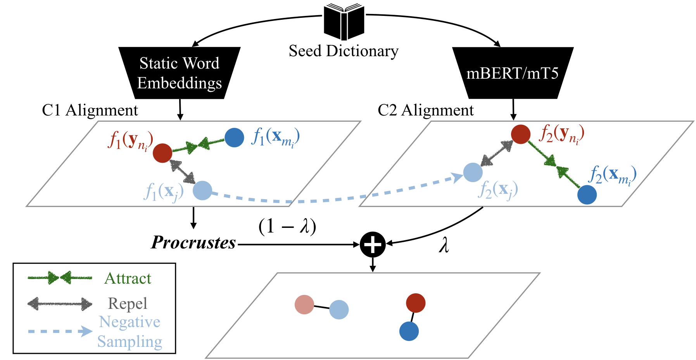

# Improving Word Translation via Two-Stage Contrastive Learning

This repository is the official PyTorch implementation of the following paper: 

Yaoyiran Li, Fangyu Liu, Nigel Collier, Anna Korhonen, and Ivan Vulić. 2022. *Improving Word Translation via Two-Stage Contrastive Learning*. In Proceedings of the 60th Annual Meeting of the Association for Computational Linguistics (ACL 2022). [LINK](https://arxiv.org/abs/2203.08307)



The work addresses the problem of Bilingual Lexicon Induction (BLI) / Word Translation. Our method consists of two consecutive stages, i.e., C1 and C2: each stage can learn its own cross-lingual word embeddings (CLWEs). Stage C1 uses static word embeddings (e.g., fastText) only. As an independent model, C1 can be evaluated separately and thus serves as a strong fastText-based baseline for BLI tasks. Stage C2 leverages both C1-aligned CLWEs, and a pretrained multilingual LM such as mBERT / XLM / mT5 to further improve the BLI performance. Of course, C2 is compatible with other CLWE models: you could instead use, say, VecMap or RCSLS to derive CLWEs which can then replace C1-aligned CLWEs in C2!    

## Dependencies:

- PyTorch 1.7.0
- Transformers 4.4.2

## Get Data:
Our data are obtained from the [XLING repo](https://github.com/codogogo/xling-eval), and we include some simple codes to download its BLI dictionaries and preprocessed word embeddings.
```bash
sh get_data.sh
```


## Run the Code:
Stage C1 (Training and Evaluation over 28 language pairs in both directions):
```bash
cd C1
sh run_all.sh
```

Stage C2 (Training and Evaluation over 28 language pairs in both directions):
```bash
cd C2
sh run_all.sh
```
Since our method is symmetric, it is not needed to train separate models for source->target translation and target->source translation. Each of Stage C1 and Stage C2 will output 4 scores in a single run, for each language pair. I.e., for a language pair (L1, L2), you will get the following 4 scores together: 
1. P@1 via NN retrieval for L1->L2; 
2. P@1 via CSLS retrieval for L1->L2; 
3. P@1 via NN retrieval for L2->L1; 
4. P@1 via CSLS retrieval for L2->L1.


## Environment Setup:

Here is our software environment that we use for our main experiments. Please feel free to skip this part if you would like to adopt different settings. If the software environment changes, the experimental results can slightly fluctuate, but it will not influence the overall robustness. 

Our original implementation uses Nvidia Driver 465.19.01 and depends on the Nvidia official docker image pytorch:20.10-py3 [LINK](https://docs.nvidia.com/deeplearning/frameworks/pytorch-release-notes/rel_20-10.html#rel_20-10) which specifies the following: Ubuntu 18.04, Python 3.6.10, Cuda 11.1.0, cuDNN 8.0.4, NCCL 2.7.8, PyTorch 1.7.0 and TensorRT 7.2.1.

Step 1. Build a docker container:
```bash
sudo docker pull nvcr.io/nvidia/pytorch:20.10-py3
sudo nvidia-docker run --shm-size=1g --ulimit memlock=-1 --ulimit stack=67108864 -e LANG=en_SG.utf8 -e LANGUAGE=en_SG:en -e LC_ALL=en_SG.utf8 -v [Storage Mapping] -it --ipc host --name [Container Name] [Image ID]
```

Step 2. Install dependancies:
```bash
sudo nvidia-docker start [Container Name]
sudo nvidia-docker attach [Container Name]
git clone https://github.com/cambridgeltl/ContrastiveBLI.git
cd ContrastiveBLI 
sh setup.sh
```

## Tips on Hyper-parameter Search:

When running experiments on a different dataset, on different language pairs or having different BLI settings such as dictionary sizes, word embeddings (WEs) or pretrained LMs, doing hyper-parameter search in both Stage C1 and Stage C2 is necessary, whenever a dev set is available.
 
1. In C1, you might use valid_every = 10 to track the BLI performance when doing hyper-parameter search. If the BLI accuracy score (on your dev set) in each training epoch obviously drops from some point, then reduce num_games, lr, or gamma in C1/src/main.py; otherwise you may increase them.

2. In C1, when having a different train_size (other than 1k and 5k), we would recommend to tune num_sl, num_aug, and dico_max_rank (in C1/src/main.py) on your dev set. Besides, you may need to modify sup_batch_size and mini_batch_size according to your train_size.

3. lambda_ in C2/run_all.py is possibly sensitive to typologically remote language pairs, especially for those including lower-resource languages. We recommend to tune lambda_ in these cases.

## Sample Code A. Encode Words with mBERT(tuned):
Here is a simple example to encode words with mBERT. We uploaded to Huggingface two mBERT models tuned with BLI-oriented loss for the language pair DE-TR:  [cambridgeltl/c2_mbert_de2tr_5k](cambridgeltl/c2_mbert_de2tr_5k) and [cambridgeltl/c2_mbert_de2tr_1k](cambridgeltl/c2_mbert_de2tr_1k).

```python
import torch
from transformers import AutoTokenizer, AutoModel

model_name = "cambridgeltl/c2_mbert_de2tr_5k" # "cambridgeltl/c2_mbert_de2tr_1k"
maxlen = 6

tokenizer = AutoTokenizer.from_pretrained(model_name,use_fast=True, do_lower_case=True)
model = AutoModel.from_pretrained(model_name)

words = ["durch","benutzen","tarafından","kullanım"]
toks = tokenizer.batch_encode_plus(words, max_length = maxlen, truncation = True, padding="max_length", return_tensors="pt")      
outputs = model(**toks, output_hidden_states=True).last_hidden_state[:,0,:] 
mbert_features = outputs / (torch.norm(outputs, dim=1, keepdim=True) + 1e-9 )
```

## Sample Code B. Mix C1 & mBERT Features: 
Suppose we have C1-aligned CLWEs and mbert(tuned) features for a source langugae and a target language respectively. In Stage C2, we comebine them as follows.
```python
lambda = 0.2
# c1_features_source and c1_features_target, of size (n, 768), are C1-aligned CLWEs already mapped from the original 300-dim space (fastText) to a 768-dim space (mBERT) via Procrustes, normalised.
c2_features_source = (1.0 - lambda) * c1_features_source  + lambda * mbert_features_source 
c2_features_target = (1.0 - lambda) * c1_features_target  + lambda * mbert_features_target

# then normalise them
c2_features_source = c2_features_source / (torch.norm(c2_features_source, dim=1, keepdim=True) + 1e-9 )
c2_features_target = c2_features_target / (torch.norm(c2_features_target, dim=1, keepdim=True) + 1e-9 )
```
## Sample Code C. Word Translation:
Here is a simple implementation of source->target word translation via NN retrieval (for CSLS retrieval, see ./C1/util.py). Note that Stage C1 can be evaluated independently.
```python
# Stage C1: c1_features_source and c1_features_target are of size (n, 300) before Procrustes mapping, normalised. 
sims_source_to_target = c1_features_source @ c1_features_target.T
target_predict = torch.argmax(sims_source_to_target, dim=1)
 
# Stage C2: c2_features_source and c2_features_target are of size (n, 768), normalised.
sims_source_to_target = c2_features_source @ c2_features_target.T
target_predict = torch.argmax(sims_source_to_target, dim=1)
```

## Baseline Methods:

The four baselines covered in our experiments are [RCSLS](https://github.com/facebookresearch/fastText/tree/main/alignment), [VecMap](https://github.com/artetxem/vecmap), [LNMap](https://github.com/taasnim/lnmap) and [FIPP](https://github.com/vinsachi/FIPPCLE). When running these baseline models, we follow their own original settings and hyperparamter values suggested in their respective repositories: e.g., using each method's own word embedding preprocessing method, self-learning algorithm (VecMap, LNMap and FIPP), and hyperparameter values recommended respectively for supervised (5k) and semi-supervised (1k) settings (e.g., VecMap recommends to switch of self-learning in supervised setups). We verified that these suggested settings yield (near-)optimal BLI performance.  

## Known Issues:

It is reported that T5/mT5 produces "nan" outputs under mixed-precision or fp16 mode when using some Transformer versions ([ISSUE](https://discuss.huggingface.co/t/t5-fp16-issue-is-fixed/3139)). Our code also suffers from this issue. When running Stage C2 with mT5, we recommend to switch off amp by commenting line 54 in ./C2/src/metric_learning.py.

## Acknowledgements:

Part of our code is adapted from the following GitHub repos: [XLING](https://github.com/codogogo/xling-eval), [RCSLS](https://github.com/facebookresearch/fastText/tree/main/alignment), [VecMap](https://github.com/artetxem/vecmap), [Mirror-BERT](https://github.com/cambridgeltl/mirror-bert) and [ECNMT](https://github.com/cambridgeltl/ECNMT). 

## If you find our paper and resources useful, please kindly cite our paper:
```bibtex
@inproceedings{YL:BLI2022,
    author    = {Yaoyiran Li and Fangyu Liu and Nigel Collier and Anna Korhonen and Ivan Vulić},
    title     = {Improving Word Translation via Two-Stage Contrastive Learning},
    year      = {2022},
    booktitle = {Proceedings of the 60th Annual Meeting of the Association for Computational Linguistics},
}
```
